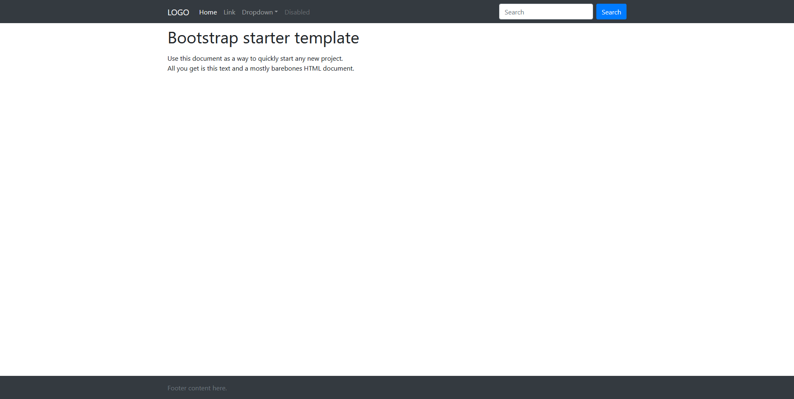

# Bootstrap Starter Theme
Statik bir web projesi için başlangıç paketidir. Projenizde Bootstrap kullanıyorsanız; bu paket ile projeye başlamak oldukça kolay ve eğlenceli olacaktır.

Bootstrap-Starter-Theme güncel olarak: 
- Bootstrap 4.5.3 
- jQuery 3.5.1

kullanmaktadır.

## Açıklama:
HTML kısımları; Jade ile oluşturulmuştur. Jade kullanımı kolay ve aynı zamanda HTML'nin büyümesinden kaynaklı sorunların önüne geçecektir.

CSS kısımları; SCSS ile oluşturulmuştur. Yine aynı şekilde; tek bir sayfada CSS kodlarını oluşturmak yerine; birden fazla sayfada CSS kodlarınızı düzenleyebilirsiniz. Böylelikle CSS kodlarınız lokalize olur ve değiştirilmesi-geliştirilmesi kolaylaşır.

**İlgili Bağlantılar**
https://jade-lang.com
https://sass-lang.com

Jade, jade-kit proje alt yapısını kullanır. jade-kit, tek başına da kullanılabilir.
SCSS, sass-kit proje alt yapısını kullanır. sass-kit, tek başına da kullanılabilir.

**jade-kit:** https://github.com/ecoztas/jade-kit
**sass-kit:** https://github.com/ecoztas/sass-kit

Ayrıca; Bootstrap Starter Theme, websiteleton genel proje yapısını kullanır. websiteleton'u da istediğiniz herhangi bir projede, ana proje çerçevesi olarak kullanabilirsiniz.

**websiteleton:** https://github.com/ecoztas/websiteleton


## Kurulum
Bootstrap Starter Theme'i indirip herhangi bir dizinde çalışabilirsiniz. Jade ve SCSS ile çalışacaksanız eğer; gerekli olan dosyaları indirmeniz gerekmektedir.

Bilgisayarınızda, NodeJS kurulu ve NPM veya Yarn paket yöneticilerden herhangi birinin aktif olduğunu varsayarsak, proje kök dizininde console (terminal veya CMD)'de aşağıdaki komutları vermemiz yeterli olacaktır.

```
// NPM ile kurulum:
$ npm install

// Yarn ile kurulum:
$ yarn install
```

Ayrıca; package.json dosyası içerisinde proje detaylarını bulabilirsiniz. package.json dosyasında da görebileceğiniz üzere; proje yapısı Gulp task manager'i kullanmaktadır. Gulp'ın da bilgisayarınızda kurulu olması gerekmektedir. Gulp yerine; Grunt veya herhangi diğer task manager kullanıyorsanız; kolaylıkla değişiklik sağlayabilirsiniz.

gulpfile.js dosyasında gerekli derleme metotları tanımlanmıştır.
```
// SCSS derleme işlemi için:
$ gulp sass

// Jade derleme işlemi için:
$gulp jade
```

## Kullanımı
Bootstrap Starter Theme'nin kullanımı oldukça basittir. Bütün geliştirme işlemi; `public/template` dizininde gerçekleşmektedir. jade-kit dizininde Jade komutlarını yazabilirsiniz. sass-kit dizininde de SCSS kodlarınızı yazabilirsiniz.

jade-kit dizinindeki `*.jade` uzantılı sayfalar, proje kök dizinine derlenir ve HTML sayfalarını oluşturur. sass-kit dizinindeki, `theme.scss` dosyası ise; `public/styles` dizinine derlenir ve `theme.css` ve `theme.min.css` dosyalarını oluştururlar.

Daha önce de söylediğim gibi; yukarıdaki işlemleri gerçekleştirmek yerine doğrudan klasik şekilde çalışabilirsiniz. Bu projenin amacı; Front-End geliştirme kısmını rahatlatmak ve kolaylaştırmaktır.

> :bulb: Daha önce de söylediğim gibi; yukarıdaki işlemleri gerçekleştirmek yerine doğrudan klasik şekilde çalışabilirsiniz. Bu projenin amacı; Front-End geliştirme kısmını rahatlatmak ve kolaylaştırmaktır. Dolayısıyla; Jade ve SCSS kullanmak yerine HTML-CSS-JS şeklinde ilerleyebilirsiniz.

## Canlı Sunum
Bootstrap Starter Theme'in görüntüsü aşağıdaki gibidir.


